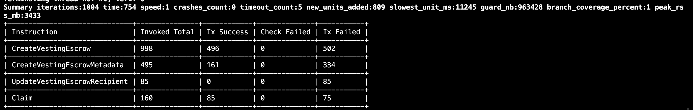
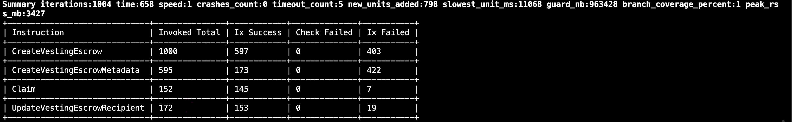

# Ackee Solana Auditors Bootcamp task submission by Lezend

I have selected the [Jupiter Lock program](https://lock.jup.ag/) from the renowned Jupiter team for this fuzz testing task.

Program mainnet address: `LocpQgucEQHbqNABEYvBvwoxCPsSbG91A1QaQhQQqjn`
[Docs](https://station.jup.ag/guides/jupiter-lock/jupiter-lock) | [Source code](https://github.com/jup-ag/jup-lock)

## Introduction

This open-source program provides a free solution to lock and distribute tokens over time. Here is a brief overview of the instructions:

- `create_vesting_escrow`: The sender/initiator creates an escrow account and deposits the required tokens, including the recipient’s details.
- `create_vesting_escrow_metadata`: Creates and stores additional metadata, such as the recipient’s email, if necessary.
- `claim`: Verifies and transfers tokens from escrow to the receiver based on the unlocked amount.
- `update_vesting_escrow_recipient`: Allows the sender or recipient to change the recipient’s public key if needed.

For detailed information about the program, please refer to the official [docs](https://station.jup.ag/guides/jupiter-lock/jupiter-lock).

## Fuzzing with Trident

### Fuzzing setup and preparation

These are the major steps I have taken to set up Trident for fuzz testing the program:

#### 1. Debug and Arbitrary traits

The Lock program uses custom types as instruction data arguments. I derived the `Debug` and `Arbitrary` traits within the program wherever necessary, following the steps outlined in the [trident docs](https://ackee.xyz/trident/docs/latest/fuzzing/writing-fuzz-test-extra/custom-data-types/#derive-debug-and-arbitrary-traits-inside-your-program).

#### 2. Structured data

Upon review, it is evident that the `create_vesting_escrow` instruction immediately triggers an error if the following assertions failed.

```rust
    require!(
        cliff_time >= vesting_start_time,
        LockerError::InvalidVestingStartTime
    );

    require!(
        UpdateRecipientMode::try_from(update_recipient_mode).is_ok(),
        LockerError::InvalidUpdateRecipientMode,
    );

    require!(frequency != 0, LockerError::FrequencyIsZero);
```

Therefore, I structured the instruction data for fuzz tests by restricting it to these ranges, making the tests more viable.

```rust
#[derive(AnchorSerialize, AnchorDeserialize, Arbitrary, Debug)]
pub struct CreateVestingEscrowParameters {
    #[arbitrary(
        with = |u: &mut arbitrary::Unstructured| u.int_in_range(0..=1_000_000)
    )]
    pub vesting_start_time: u64,
    #[arbitrary(
        with = |u: &mut arbitrary::Unstructured| u.int_in_range(1_000_000..=u64::MAX)
    )]
    pub cliff_time: u64,
    #[arbitrary(
        with = |u: &mut arbitrary::Unstructured| u.int_in_range(1..=u64::MAX)
    )]
    pub frequency: u64,
    pub cliff_unlock_amount: u64,
    pub amount_per_period: u64,
    pub number_of_period: u64,
    #[arbitrary(
        with = |u: &mut arbitrary::Unstructured| u.int_in_range(0..=3)
    )]
    pub update_recipient_mode: u8,
}
```

#### 3. Account Stores

Various instructions in the program require the same accounts but with different names in the context. Therefore, I have commented out the account stores and limited the account generation as needed.

```rust
pub struct FuzzAccounts {
    base: AccountsStorage<Keypair>,
    token_mint: AccountsStorage<MintStore>,
    // creator: AccountsStorage<Keypair>,
    escrow: AccountsStorage<PdaStore>,
    escrow_metadata: AccountsStorage<PdaStore>,
    escrow_token: AccountsStorage<PdaStore>,
    // Event authority is constant.
    // event_authority: AccountsStorage<Keypair>,
    // payer: AccountsStorage<Keypair>,
    // Program ID is constant for event CPI.
    // program: AccountsStorage<ProgramStore>,
    recipient: AccountsStorage<Keypair>,
    // recipient_token: AccountsStorage<TokenStore>,
    sender: AccountsStorage<Keypair>,
    // sender_token: AccountsStorage<TokenStore>,
    // signer: AccountsStorage<Keypair>,
    // system_program: AccountsStorage<ProgramStore>,
    // token_program: AccountsStorage<ProgramStore>,
}
```

Additionally, I manually added new accounts to the various instruction accounts in `fuzz_instruction.rs`, which are required as seeds during PDA generation.

#### 4. Instruction sequence

I've specified `create_vesting_escrow` and `create_vesting_escrow_metadata` instructions to be executed first.

```rust
fn pre_ixs(u: &mut arbitrary::Unstructured) -> arbitrary::Result<Vec<FuzzInstruction>> {
        let create_vesting_escrow =
            FuzzInstruction::CreateVestingEscrow(CreateVestingEscrow::arbitrary(u)?);
        let create_vesting_escrow_metadata = FuzzInstruction::CreateVestingEscrowMetadata(
            CreateVestingEscrowMetadata::arbitrary(u)?,
        );

        Ok(vec![create_vesting_escrow, create_vesting_escrow_metadata])
    }
```

#### 5. Client customization

I utilized the Trident fuzz client's `set_token_account` and `set_account_custom` methods to pre-create accounts where appropriate.

#### 6. Invariant checks

I have added the following checks to test the correctness of the program's logic:

```rust
// create_vesting_escrow
fn check(
    &self,
    pre_ix: Self::IxSnapshot,
    post_ix: Self::IxSnapshot,
    ix_data: Self::IxData,
) -> Result<(), FuzzingError> {
    if let Ok(deposit_amount) = ix_data.params.get_total_deposit_amount() {
        // Check if the sender has sent the correct amount of tokens
        if post_ix.sender_token.amount != pre_ix.sender_token.amount - deposit_amount {
            return Err(FuzzingError::Custom(1));
        }

        // Check if the escrow has received the correct amount of tokens
        if post_ix.escrow_token.amount != pre_ix.escrow_token.amount + deposit_amount {
            return Err(FuzzingError::Custom(2));
        }
    }

    Ok(())
}

// claim
fn check(
    &self,
    pre_ix: Self::IxSnapshot,
    post_ix: Self::IxSnapshot,
    _ix_data: Self::IxData,
) -> Result<(), FuzzingError> {
    // Check if the recipient has received tokens
    // Claim amount can be 0, thats why we use >
    if pre_ix.recipient_token.amount > post_ix.recipient_token.amount {
        return Err(FuzzingError::Custom(3));
    }

    // Check if the escrow has sent tokens
    if pre_ix.escrow_token.amount < post_ix.escrow_token.amount {
        return Err(FuzzingError::Custom(4));
    }
    Ok(())
}

// update_vesting_escrow_recipient
fn check(
    &self,
    _pre_ix: Self::IxSnapshot,
    post_ix: Self::IxSnapshot,
    ix_data: Self::IxData,
) -> Result<(), FuzzingError> {
    // Check if the recipient is updated
    if post_ix.escrow.recipient != ix_data.new_recipient {
    return Err(FuzzingError::Custom(5));
    }
    Ok(())
}
```

### Test results and analysis

#### fuzz_0



As seen from the fuzz test output, out of 1000 iterations, there were no crashes or panics. The program correctly handles arithmetic overflows, and no invariant checks were violated.

The only issue I found was that `UpdateVestingEscrowRecipient` had 0 instruction successes. To verify, I made minor adjustments and created another fuzz test, `fuzz_1`.

#### fuzz_1

I've made the following changes from `fuzz_0`:

- Changed `update_recipient_mode` data to 3, instead of randomizing it. The value 3 allows either the creator or recipient to update the recipient.

```rust
fn get_data(
    &self,
    _client: &mut impl FuzzClient,
    _fuzz_accounts: &mut FuzzAccounts,
) -> Result<Self::IxData, FuzzingError> {
    let data = locker::instruction::CreateVestingEscrow {
        params: CreateVestingEscrowParameters {
            vesting_start_time: self.data.params.vesting_start_time,
            cliff_time: self.data.params.cliff_time,
            frequency: self.data.params.frequency,
            cliff_unlock_amount: self.data.params.cliff_unlock_amount,
            amount_per_period: self.data.params.amount_per_period,
            number_of_period: self.data.params.number_of_period,
            update_recipient_mode: 3,
        },
    };
    Ok(data)
}
```

- Set the instruction sequence to run `update_vesting_escrow_recipient` before `claim`, ensuring it gets more iterations by executing first.

```rust
fn ixs(u: &mut arbitrary::Unstructured) -> arbitrary::Result<Vec<FuzzInstruction>> {
    let claim = FuzzInstruction::Claim(Claim::arbitrary(u)?);
    let update_vesting_escrow = FuzzInstruction::UpdateVestingEscrowRecipient(
        UpdateVestingEscrowRecipient::arbitrary(u)?,
    );

    Ok(vec![update_vesting_escrow, claim])
}
```



As seen from the output, `UpdateVestingEscrowRecipient` has a good number of instruction successes, indicating it is correctly updating the recipient. This suggests that with more streamlined data input, the instruction succeeds, confirming that there is no issue with the Trident fuzz testing setup.

### Conclusion

My testing concludes that the Jupiter lock program has no bugs and successfully handles edge cases. However, I believe this may not fully reflect real-world scenarios, as the fuzz test iterations should be significantly higher than 1000.

## Feedback on Trident

Trident has proven to be an excellent tool for fuzz testing the Jupiter Lock program. As far as I know, it is the first tool specifically designed for fuzz testing Solana programs. However, I encountered a few challenges during setup and execution.

1. **Support for Mac**: I was unable to build and fuzz natively on my M3 Silicon Mac.

2. **Build times**: Optimizing the build process would be appreciated, as both run and run-debug commands take significantly long to complete.

3. **AccountLoader Support**: Trident fuzz testing panics when the `AccountLoader` type is used in an instruction's context, particularly where the `load_init()` method is called. More details can be found in my [Discord post](https://discord.com/channels/867746290678104064/1281578025150054411) in the [dev-help](https://discord.com/channels/867746290678104064/1272606680911315077) forum. For this task, I replaced the `AccountLoader` type with `Account`, which is not ideal for testing the original program.

Finally, I would appreciate your feedback on my task. Please let me know if I made any mistakes or if there are areas where my testing could have been improved. Thank you and best regards.
